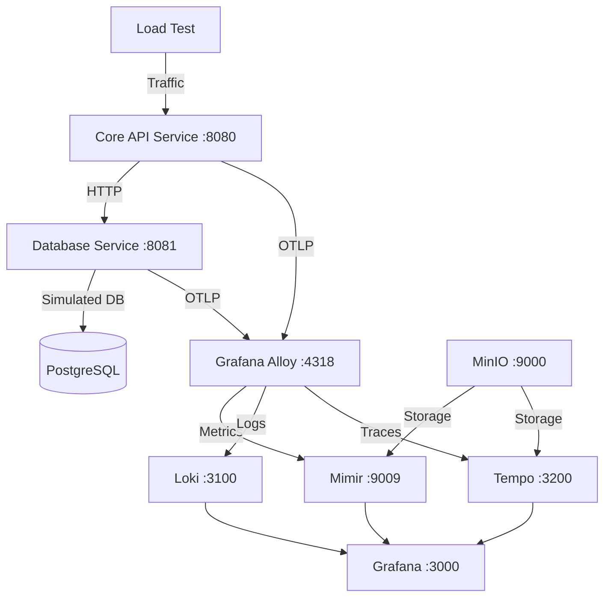

# AI-Driven Observability Demo

## Overview

This repository demonstrates a complete observability stack using OpenTelemetry with Go microservices. The system showcases distributed tracing, metrics collection, and structured logging with incident simulation for realistic observability scenarios.

## Architecture



## Services

### Core API Service (Port 8080)
- REST API for transaction processing
- OpenTelemetry instrumentation for traces, metrics, and logs
- Endpoints: `/api/transaction`, `/api/user/{id}/balance`, `/api/health`
- Metrics: transaction counters, response times, error rates

### Database Service (Port 8081)
- Simulates database operations with realistic latency
- Incident simulation (connection timeouts, high latency, deadlocks)
- Endpoints: `/db/query`, `/db/health`, `/db/metrics`
- Metrics: query duration, connection counts, incident status

## Observability Stack

### Data Collection
- **Grafana Alloy**: OpenTelemetry collector and distributor
- **OTLP**: HTTP/gRPC endpoints for telemetry data

### Storage
- **Grafana Mimir**: Metrics storage (Prometheus-compatible)
- **Grafana Loki**: Log aggregation and storage
- **Grafana Tempo**: Distributed tracing storage
- **MinIO**: Object storage backend

### Visualization
- **Grafana**: Unified observability dashboard
- Pre-configured datasources for all telemetry types

## Quick Start

1. **Start observability infrastructure:**
   ```bash
   cd infra/otel
   docker-compose up -d
   ```

2. **Run the applications:**
   ```bash
   # Terminal 1 - Database Service
   cd app/database
   go run main.go
   
   # Terminal 2 - Core API Service
   cd app/core
   go run main.go
   ```

3. **Generate load:**
   ```bash
   cd app
   ./load-test.sh
   ```

4. **Access Grafana:**
   - URL: http://localhost:3000
   - No authentication required

## Features

### Incident Simulation
- Automatic incident generation every 45 seconds (25% probability)
- Incident types: connection_timeout, high_latency, connection_refused, deadlock, disk_full
- Realistic error rates and latency patterns during incidents

### Telemetry Data
- **Traces**: End-to-end request tracing across services
- **Metrics**: Business and infrastructure metrics
- **Logs**: Structured logging with correlation IDs

### Load Testing
- Concurrent request generation
- Configurable endpoints and request patterns
- Realistic user simulation

## Configuration

### Environment Variables
- `OTEL_EXPORTER_OTLP_ENDPOINT`: OpenTelemetry collector endpoint
- `DB_SERVICE_URL`: Database service URL for core API

### Docker Services
- Grafana: :3000
- Loki: :3100
- Tempo: :3200
- Mimir: :9009
- MinIO: :9000
- Alloy: :4318 (HTTP), :4317 (gRPC)
- Portainer: :9001

## Project Structure

```
ai-driven-observability/
├── app/
│   ├── core/           # Core API service (Go)
│   ├── database/       # Database service (Go)
│   ├── load-test.sh    # Load testing script
│   └── ingest-log.sh   # Manual log ingestion
├── infra/
│   └── otel/           # Observability infrastructure
│       ├── docker-compose.yaml
│       ├── alloy-config.alloy
│       └── *-config.yaml
└── README.md
```