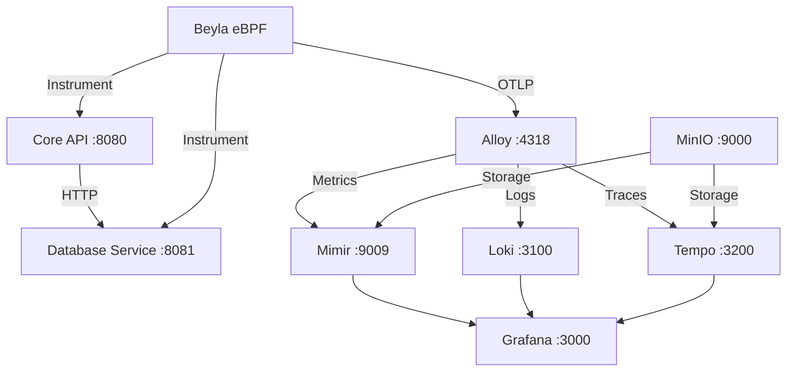

# AI-Driven Observability with Beyla Auto-Instrumentation

## Overview

Complete observability stack using **Grafana Beyla** for automatic instrumentation of Go microservices. Zero-code instrumentation with distributed tracing, RED metrics, and HTTP request logging.

## Architecture



## What Beyla Captures

- **HTTP Traces**: Distributed request/response spans
- **RED Metrics**: Rate, Errors, Duration + body sizes
- **HTTP Request Logs**: Method, URL, status, duration
- **Network Flow Metrics**: Connection-level data

## Quick Start

1. **Start the observability stack**:
   ```bash
   docker compose up --build -d
   ```

2. **Generate traffic to create observability data**:
   ```bash
   bash load-test.sh
   ```

3. **Access Grafana Dashboard**:
   - URL: http://localhost:3000
   - Dashboard: **Beyla RED Metrics & Operations**
   - No authentication required

## Dashboard Features

### RED Metrics
- **Rate**: Requests per second by service
- **Errors**: Error percentage with color thresholds
- **Duration**: P95 response time in milliseconds

### Operational Monitoring
- **Request Rate Over Time**: RPS trends
- **Response Time Percentiles**: P50/P95 latency
- **HTTP Status Codes**: Response distribution
- **Top Endpoints**: Busiest API routes
- **Network Flow Bytes**: Traffic volume

### Forecasting & Alerting
- **5-minute rate windows** for trend analysis
- **Real-time refresh** (5-second intervals)
- **Color-coded thresholds** for immediate alerts

## Beyla Configuration

### Network + Application Monitoring
```yaml
discovery:
  services:
    - exe_path: /usr/local/bin/core-service

network:
  enable: true

otel:
  endpoint: http://alloy:4318
  insecure: true
  traces:
    sampler: always_on
  metrics:
    interval: 5s
  logs:
    submit: opentelemetry

http_request_trace: true
print_traces: true
log_level: debug
```

## Available Metrics

### Rate (Requests/sec)
```promql
rate(http_server_request_duration_seconds_count[5m])
```

### Errors (Error rate %)
```promql
rate(http_server_request_duration_seconds_count{http_response_status_code=~"4..|5.."}[5m]) / rate(http_server_request_duration_seconds_count[5m]) * 100
```

### Duration (P95 latency)
```promql
histogram_quantile(0.95, rate(http_server_request_duration_seconds_bucket[5m]))
```

## Services

- **Core API** (:8080): Transaction processing
- **Database Service** (:8081): Simulated DB operations
- **Grafana** (:3000): Visualization dashboard
- **Loki** (:3100): Log storage
- **Tempo** (:3200): Trace storage
- **Mimir** (:9009): Metrics storage
- **Alloy** (:4318): OTLP collector

## Zero-Code Benefits

- **No OpenTelemetry SDK** in application code
- **No manual instrumentation** - eBPF handles everything
- **Standard Go slog** - Clean application logging
- **Automatic discovery** - Beyla finds processes
- **Language agnostic** - Works with any HTTP service

## Cleanup

```bash
docker compose down -v
docker system prune -f
```

## Project Structure

```
app-auto-instrumented/
├── core/                        # Core API service
│   ├── beyla-config.yml        # Beyla configuration
│   └── Dockerfile              # Multi-stage with Beyla
├── database/                   # Database service
│   ├── beyla-config.yml       # Beyla configuration
│   └── Dockerfile             # Multi-stage with Beyla
├── grafana-dashboards/         # Provisioned dashboards
│   └── beyla-red-metrics.json # RED metrics dashboard
├── docker-compose.yml          # Complete LGTM stack
├── alloy-config.alloy         # OTLP collector config
├── load-test.sh              # Traffic generation
└── README.md
```